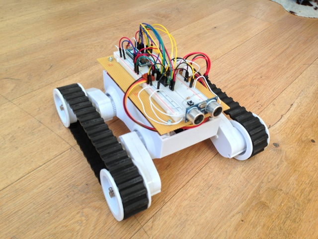

Rover5
======

Arduino controls a tracked rover with quadrature encoders and ultrasonic sonsor using Jonathan Lamothes multi threading library [mthread](https://github.com/jlamothe/mthread). All input and outputs are encapsuled with a Thread class and no delay() is used which would block other threads. 

Components

* [Arduino Micro](http://arduino.cc/en/Main/ArduinoBoardMicro)
* [Dagu Rover 5 Tracked Chassis with Encoders](http://www.pololu.com/product/1551)
* [DRV8835 Dual Motor Driver Carrier](http://www.pololu.com/product/2135)
* [HC-SR04 Ultrasonic module](http://www.hobbyking.com/hobbyking/store/uh_viewitem.asp?idproduct=31136&aff=272191)

